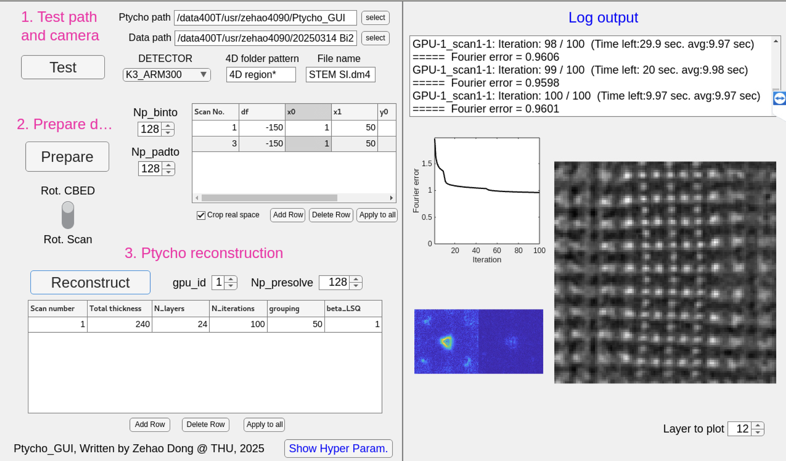

# Ptycho_GUI README

## Overview

Ptycho_GUI is a MATLAB-based graphical user interface designed for performing ptychographic reconstructions from 4D-STEM datasets. The software facilitates data preprocessing, parameter selection, and sequential reconstructions of multiple datasets.

**Note: Ptycho_GUI is in a very early stage! currently supports .dm4 files from K3, .raw files from EMPAD, and .h5 files from ARINA. Maybe more features will be added in the future for generalization**

The code builds upon previous MATLAB implementations from the **Science IT** and **Coherent X-ray Scattering (CXS)** groups at the Paul Scherrer Institut (PSI), Switzerland ([link](https://www.psi.ch/en/sls/csaxs/software)), as well as Yi Jiang’s work on X-ray/electron ptychography ([fold_slice repository](https://github.com/yijiang1/fold_slice)).

Please ensure compliance with the copyright and license agreements of these projects.

## Features

### One click for loading multiple datasets for Ptycho

### One Click for Reconstructing multiple datasets

## Requirements

- MATLAB (Tested with MATLAB 2023a and later)
- Required MATLAB toolboxes:
  - Parallel Computing Toolbox
  - Curve Fitting Toolbox
  - Image Processing Toolbox
  - Optimization Toolbox
  - Signal Processing Toolbox
- Ptychography scripts and dependencies are all included in the `Ptycho_GUI` directory

## Installation

1. Clone or download the `Ptycho_GUI` repository.
   - git clone suggested to keep up with future updates.

2. Open MATLAB and navigate to the `Ptycho_GUI\dist` folder.
3. Run `Ptycho_GUI.mlappinstall` to install Ptycho_GUI in MATLAB.

## Example Workflow

### Left panel: tunable parameters

1. **Path initialization**: Select appropriate paths and click "Test."
   - **Ptycho path**: path to `ptycho_GUI`
   - **Data path**: Choose the dataset folder containing 4D-STEM data (multiple datasets can be found).
   - **Optional: Output path**: Customize the output path for ptycho results. Default path will be `\Data_path\All_Data`.
2. **Prepare data**: 
   - Select your camera (detector) parameters (saved in `Ptycho_GUI\+configs\xxxx.mat`), including voltage, alpha, rbf, stepsize, rotation, ADU, which you can check and change in the `Show Hyper Param.` tab.
     - MORE PARAMETERS CAN BE LOADED WITH CUSTOMLY SAVED `.mat` FILES IN `+configs`.
   - Select which dataset (scan number) to be prepared, and the corresponding defocus value (minus values represent over-focus). Note that multiple datasets can be prepared on one click.
   - Adjust binning and padding parameters for CBED, then click "Prepare."
   
3. **Set reconstruction parameters**: Define which dataset (scan number), thickness, layers, iterations, and other parameters. (details in below).
4. **Run reconstruction**: Click "Reconstruct" and monitor progress in the right panel.
5. **Adjust hyperparameters (if needed)**: Use the "Show Hyper Param." option to fine-tune settings.
6. **Analyze results**: Inspect the reconstructed phase image and Fourier error convergence plot.

### Right panel: Log outputs

1. **Log output**: Information outputs
2. **Figure outputs**: 
   - Fourier error vs. iteration number plot
   - Real-time reconstructed multi-modal probe
   - Real-time reconstructed phase image of object

## User Interface and Parameters Guide

### 1. Test Path and Camera

- **Ptycho path**: Select the directory to `ptycho_GUI`.
- **Data path**: Choose the dataset folder containing 4D-STEM datasets.
- **Detector**: Select the detector parameters saved in `+config\detectorname.mat`(e.g., K3_ARM300).
- **4D folder pattern**: Define the folder structure for loading multiple datasets.
- **File name**: filename for the 4D dataset.
- **Test button**: Verifies if the selected paths and camera settings are correct.

### 2. Prepare Data

- **Np_binto**: Set the binning factor for reducing dataset size.
- **Np_padto**: Define the padding size for diffraction patterns (padding zeros).
- **Rotate CBED?**: Choose whether to rotate the convergent beam electron diffraction (CBED) patterns.
- **Save dp?**: Select whether to save the `dp.hdf5` files
- **Scan number**: Defines the datasets to be prepared.
- **df**: Set the defocus value for each scan (minus values represent over-focus).
- **Prepare button**: Prepare the data for ptychographic reconstruction.
- **Scan Rot.**: Scan rotation during experiments. Automatically determined for .dm4 file; manually given for .raw and .h5 files.

### 3. Ptycho Reconstruction

- **Scan number**: Defines the datasets to be reconstructed.
- **Total thickness**: sample thickness for multislice reconstruction.
- **N_layers**: Number of layers in multislice simulations.
- **N_iterations**: Number of iterations for the reconstruction.
- **Grouping**: batch size for reconstructions.
- **beta-LSQ**: similar to the learning rate in deep learning (1.0 is usually fine).
- **GPU id**: Choose the GPU device for reconstruction.
- **Np_presolve**: Set the region of CBED to be reconstructed (normally equals Np_padto).
- **Reconstruct button**: Begins the iterative reconstruction process.

### Log Output

- Displays real-time progress of the reconstruction, including iteration count, Fourier error, and estimated time remaining.
- Plots Fourier error convergence.
- Shows reconstructed phase image of the sample and amplitude image of the probe.

### Hyper-parameters (Optional)

Clicking "Show Hyper Param." reveals additional reconstruction settings:

- **Acc. Volt**: Acceleration voltage of the electron beam (e.g., 300 keV).
- **Alpha**: Convergence semi-angle in mrad.
- **rbf**: radius of bright-field disk in pixel.
- **Step size**: scanning step size in angstroms.
- **blur (PSF)**: Point spread function blur factor.
- **Probe mode**: Number of probe modes used.
- **reg_layer**: Regularization factor for multislice reconstuctions.
- **Remove ambiguity?**: Toggle for ambiguity removal in phase retrieval.
- **Niter probe upd.**: Number of iteration to start probe update.
- **Niter save**: Interval for saving intermediate results.
- **Niter pos. corr.**: Number of iteration to start position correction.
- **Niter plot**: Interval for plotting results in Log output panel.

## Contact

For questions or bug reports, please contact dzh22@mails.tsinghua.edu.cn.

# Academic License Agreement

Source Code

Introduction 

This license agreement sets forth the terms and conditions under which the PAUL SCHERRER INSTITUT (PSI), CH-5232 Villigen-PSI, Switzerland (hereafter "LICENSOR") will grant you (hereafter "LICENSEE") a royalty-free, non-exclusive license for academic, non-commercial purposes only (hereafter "LICENSE") to use the cSAXS ptychography MATLAB package computer software program and associated documentation furnished hereunder (hereafter "PROGRAM").

Terms and Conditions of the LICENSE

1.	LICENSOR grants to LICENSEE a royalty-free, non-exclusive license to use the PROGRAM for academic, non-commercial purposes, upon the terms and conditions hereinafter set out and until termination of this license as set forth below.
2.	LICENSEE acknowledges that the PROGRAM is a research tool still in the development stage. The PROGRAM is provided without any related services, improvements or warranties from LICENSOR and that the LICENSE is entered into in order to enable others to utilize the PROGRAM in their academic activities. It is the LICENSEE's responsibility to ensure its proper use and the correctness of the results.
3.	THE PROGRAM IS PROVIDED "AS IS", WITHOUT WARRANTY OF ANY KIND, EXPRESS OR IMPLIED, INCLUDING BUT NOT LIMITED TO THE WARRANTIES OF MERCHANTABILITY, FITNESS FOR A PARTICULAR PURPOSE AND NONINFRINGEMENT OF ANY PATENTS, COPYRIGHTS, TRADEMARKS OR OTHER RIGHTS. IN NO EVENT SHALL THE LICENSOR, THE AUTHORS OR THE COPYRIGHT HOLDERS BE LIABLE FOR ANY CLAIM, DIRECT, INDIRECT OR CONSEQUENTIAL DAMAGES OR OTHER LIABILITY ARISING FROM, OUT OF OR IN CONNECTION WITH THE PROGRAM OR THE USE OF THE PROGRAM OR OTHER DEALINGS IN THE PROGRAM.
4.	LICENSEE agrees that it will use the PROGRAM and any modifications, improvements, or derivatives of PROGRAM that LICENSEE may create (collectively, "IMPROVEMENTS") solely for academic, non-commercial purposes and that any copy of PROGRAM or derivatives thereof shall be distributed only under the same license as PROGRAM. The terms "academic, non-commercial", as used in this Agreement, mean academic or other scholarly research which (a) is not undertaken for profit, or (b) is not intended to produce works, services, or data for commercial use, or (c) is neither conducted, nor funded, by a person or an entity engaged in the commercial use, application or exploitation of works similar to the PROGRAM.
5.	LICENSEE agrees that it shall make the following acknowledgement in any publication resulting from the use of the PROGRAM or any translation of the code into another computing language:
   "Data processing was carried out using the cSAXS ptychography MATLAB package developed by the Science IT and the coherent X-ray scattering (CXS) groups, Paul Scherrer Institut, Switzerland."

Additionally, any publication using the package, or any translation of the code into another computing language should cite

(for PtychoShelves) K. Wakonig, H.-C. Stadler, M. Odstrčil, E.H.R. Tsai, A. Diaz, M. Holler, I. Usov, J. Raabe, A. Menzel, M. Guizar-Sicairos, PtychoShelves, a versatile high-level framework for high-performance analysis of ptychographic data, J. Appl. Cryst. 53(2) (2020). (doi: 10.1107/S1600576720001776)

(for difference map) P. Thibault, M. Dierolf, A. Menzel, O. Bunk, C. David, F. Pfeiffer, High-resolution scanning X-ray diffraction microscopy, Science 321, 379-382 (2008). (doi: 10.1126/science.1158573).

(for maximum likelihood) P. Thibault and M. Guizar-Sicairos, Maximum-likelihood refinement for coherent diffractive imaging, New J. Phys. 14, 063004 (2012). (doi: 10.1088/1367-2630/14/6/063004).

(for mixed coherent modes) P. Thibault and A. Menzel, Reconstructing state mixtures from diffraction measurements, Nature 494, 68-71 (2013). (doi: 10.1038/nature11806).

(and/or for multislice) E. H. R. Tsai, I. Usov, A. Diaz, A. Menzel, and M. Guizar-Sicairos, X-ray ptychography with extended depth of field, Opt. Express 24, 29089-29108 (2016). (doi: 10.1364/OE.24.029089).

6.	Except for the above-mentioned acknowledgment, LICENSEE shall not use the PROGRAM title or the names or logos of LICENSOR, nor any adaptation thereof, nor the names of any of its employees or laboratories, in any advertising, promotional or sales material without prior written consent obtained from LICENSOR in each case.
7.	Ownership of all rights, including copyright in the PROGRAM and in any material associated therewith, shall at all times remain with LICENSOR, and LICENSEE agrees to preserve same. LICENSEE agrees not to use any portion of the PROGRAM or of any IMPROVEMENTS in any machine-readable form outside the PROGRAM, nor to make any copies except for its internal use, without prior written consent of LICENSOR. LICENSEE agrees to place the following copyright notice on any such copies: 
   @ All rights reserved. PAUL SCHERRER INSTITUT, Switzerland, Laboratory for Macromolecules and Bioimaging, 2017. 
8.	The LICENSE shall not be construed to confer any rights upon LICENSEE by implication or otherwise except as specifically set forth herein.
9.	DISCLAIMER: LICENSEE shall be aware that Phase Focus Limited of Sheffield, UK has an international portfolio of patents and pending applications which relate to ptychography and that the PROGRAM may be capable of being used in circumstances which may fall within the claims of one or more of the Phase Focus patents, in particular of patent with international application number PCT/GB2005/001464. The LICENSOR explicitly declares not to indemnify the users of the software in case Phase Focus or any other third party will open a legal action against the LICENSEE due to the use of the program.
10.	This Agreement shall be governed by the material laws of Switzerland and any dispute arising out of this Agreement or use of the PROGRAM shall be brought before the courts of Zurich, Switzerland. 